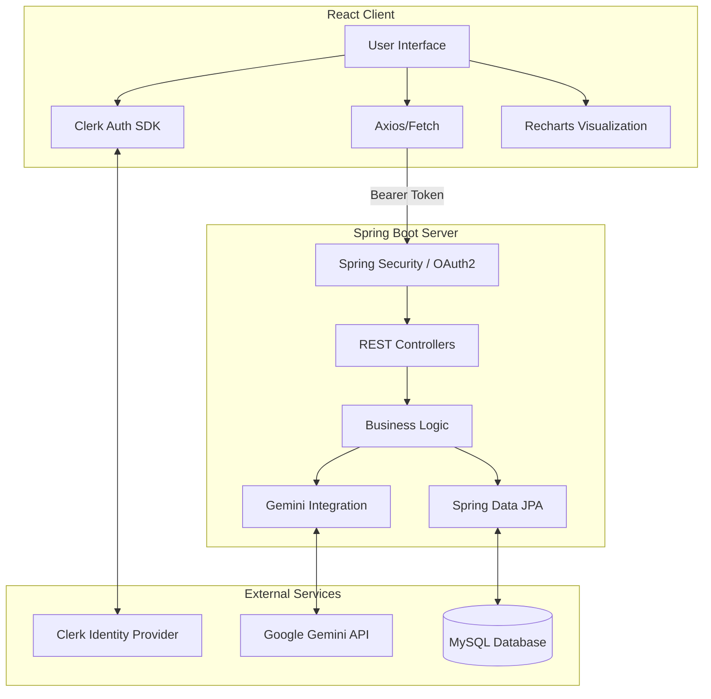

# BudgetWise AI: Intelligent Expense Tracking & Financial Visualization

## 📺 Demo & Deployment

**⚠️ Important: Watch the Full Walkthrough**
The demo video showcases the platform's core functionality, including transaction logging, budget setting, and AI insights.

* **🎥 Demo Video:** [Watch Demo on Google Drive](https://drive.google.com/drive/folders/1V5G_iblK4c_jwd1QtfdL30Tz3JhK8KyE?usp=sharing)
* **🚀 Live Deployment:** [Click Here to View Live App](https://exquisite-sunburst-9ab2a6.netlify.app/)

---

## 📖 Table of Contents

1. [Executive Summary](https://www.google.com/search?q=%23-executive-summary)
2. [Key Features](https://www.google.com/search?q=%23-key-features)
3. [System Architecture](https://www.google.com/search?q=%23-system-architecture)
4. [Technical Specifications](https://www.google.com/search?q=%23-technical-specifications)
5. [Installation & Setup](https://www.google.com/search?q=%23-installation--setup)
6. [Usage Guide](https://www.google.com/search?q=%23-usage-guide)
7. [Roadmap](https://www.google.com/search?q=%23-roadmap)
8. [License](https://www.google.com/search?q=%23-license)

---

## 🚀 Executive Summary

**BudgetWise AI** is a robust, full-stack financial management platform designed to democratize financial literacy through intelligent automation. Unlike traditional spreadsheets, BudgetWise leverages the power of **Generative AI (Google Gemini)** to analyze spending habits and provide actionable financial advice.

Built with a modern **React.js** frontend and a secure **Spring Boot** backend, the application ensures data integrity via **MySQL** while offering a seamless user experience with **Clerk Authentication**. It bridges the gap between raw financial data and meaningful insights, helping users track income, manage budgets, and visualize their financial health in real-time.

---

## ✨ Key Features

### 1. **Secure Authentication (Clerk + Spring Security)**

* **Google OAuth:** Seamless sign-in experience using Google credentials via Clerk.
* **OAuth2 Resource Server:** The Spring Boot backend validates tokens to ensure API security.

### 2. **AI-Powered Financial Advisor**

* **Gemini Integration:** Connects to Google's Gemini API via the backend to generate personalized saving tips and spending warnings based on user data.
* **Smart Insights:** Automatically detects high-spending categories and suggests budget adjustments.

### 3. **Dynamic Visualization**

* **Interactive Charts:** Utilizes **Recharts** to render beautiful, responsive graphs for Income vs. Expense analysis and Category breakdowns.
* **Smooth UI:** Enhanced with **Framer Motion** for fluid page transitions and interactive elements.

### 4. **Robust Transaction Management**

* **Full CRUD:** Create, Read, Update, and Delete transactions stored reliably in a **MySQL** database.
* **ORM Layer:** Uses **Spring Data JPA** for efficient and secure database interactions.

---

## 🏗 System Architecture

BudgetWise follows a **Decoupled Architecture**, separating the Client (Frontend) from the Server (Backend) for scalability.



---

## ⚙ Technical Specifications

### Frontend

* **Framework:** React.js
* **Styling:** Tailwind CSS, Framer Motion (Animations)
* **State Management & Routing:** React Router DOM
* **Authentication:** Clerk (with Google OAuth)
* **Charts:** Recharts
* **Icons:** Lucide React
* **Editor:** VS Code

### Backend

* **Framework:** Java, Spring Boot
* **Security:** Spring Security (OAuth2 Resource Server for Clerk integration)
* **Database:** MySQL
* **ORM:** Spring Data JPA
* **AI Integration:** Gemini API (via Google GenAI Java SDK)
* **Editor:** IntelliJ IDEA

### Tools & Support

* **Database Management:** MySQL Workbench, phpMyAdmin
* **AI Resources:** Google Gemini API

---

## 📥 Installation & Setup

### Prerequisites

* Node.js & npm
* Java JDK 17+
* MySQL Server
* Clerk Account & Gemini API Key

### 1. Backend Setup (Spring Boot)

```bash
# Clone the repository
git clone https://github.com/yourusername/budgetwise-ai.git

# Navigate to backend directory
cd budgetwise-backend

# Configure application.properties
# Add your MySQL URL, Username, Password, and Gemini API Key

# Run the application
./mvnw spring-boot:run

```

### 2. Frontend Setup (React)

```bash
# Navigate to frontend directory
cd budgetwise-frontend

# Install dependencies
npm install

# Create .env.local file
# Add: VITE_CLERK_PUBLISHABLE_KEY=your_key_here

# Run the development server
npm run dev

```

---

## 📖 Usage Guide

1. **Sign Up/Login:** Use the Clerk authentication page to sign in with your Google account.
2. **Dashboard:** View your "Total Balance," "Income," and "Expenses" at a glance.
3. **Add Transaction:** Use the form to log a new expense or income source.
4. **Ask AI:** Navigate to the AI Advisor tab and request an analysis of your current month's spending.
5. **Visualize:** Check the "Analytics" tab to see your spending breakdown by category.

---

## 🛣 Roadmap

* [ ] **Mobile App:** React Native version for iOS/Android.
* [ ] **Recurring Payments:** Automated logic for subscription tracking.
* [ ] **Export Features:** Download financial reports as PDF/CSV directly from the React UI.
* [ ] **Multi-Currency Support:** Live currency conversion for international travelers.

---
*Built with ❤️ for financial freedom.*
